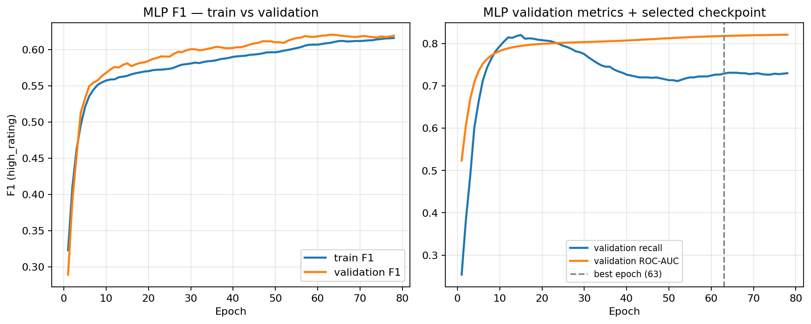

# CS 6320 — Assignment 6

**Name:** Brandon Jackson  
**Semester:** Summer 2026  
**Course:** Deep Learning (CS 6320)

---

## Part A — Portfolio tabular representation and model comparison (BGG)

**Work type:** Native tabular portfolio data (not proxy, not fallback case study).

### Portfolio problem and representation

| Item | Lock |
| --- | --- |
| Stakeholder | Hobby retailer screening preorder / initial stock for BGG-aware customers |
| Dataset | Kaggle *Board Games Database from BoardGameGeek* (`games.csv`, 21,925 rated games) |
| Unit | One row per game (`BGGId`) |
| Target | `high_rating = 1` if `AvgRating >= 7.0`, else `0` (~26.9% positive) |
| Representation | **Native tabular** — numeric design metadata, `GameWeight`, category flags, simple text-length features, parsed `goodplayers_count` |
| Part A path | Portfolio table directly (no Week 6 proxy translator) |
| Seed | `6320` |
| Implementation | `6320-hw6/scripts/`; end-to-end: `bash run_local.sh` |

Features follow the Assignment 4 charter and Assignment 5 manifest: rating fields, rank columns, popularity counts, and mis-timed demand fields (`NumOwned`, `NumWant`, `NumWish`) are **hard-excluded**. Raw `Name` / `Description` text are not fed to models — only length/count proxies (same v1 charter).

### Preprocessing and prediction-time rules

1. **Split first** — stratified random 70% / 15% / 15% by game row (unchanged from Assignment 5).
2. **Imputation** — numeric medians computed on **training rows only**, then applied to validation and test through `build_feature_matrix(..., numeric_medians=train_medians)`.
3. **Scaling** — `StandardScaler` fit on **training** features for logistic regression and MLP; trees use median-imputed raw features (scale-invariant).
4. **Categories** — eight `Cat:*` flags kept as 0/1 integers (low cardinality).
5. **Leakage** — no rating-derived or post-hoc demand columns in *X*; each game appears in one split only.

**Embeddings:** Not used. Category fields are binary flags, not repeated high-cardinality IDs. Numeric fields are not identity codes. *Embeddings were not appropriate because categories are low-cardinality one-hot flags and there are no stable high-cardinality entity IDs; I used scaled numerics plus binary category columns instead.*

### Split and audit evidence

| Split | Rows | Positive rate |
| --- | ---: | ---: |
| train | 15,347 | 26.9% |
| validation | 3,289 | 27.7% |
| test | 3,289 | 26.2% |

Positive rates are stable across splits (within ~1.5 pp). Audit tables: `prep/bgg_split/split_audit/` (counts, numeric distributions, category positive rates).

### Models compared (same target, split, metrics)

| Model | Role | Key settings |
| --- | --- | --- |
| Majority class | Sanity | Always predict not-high |
| Logistic regression | Simple linear baseline | L2, unweighted; train-fitted `StandardScaler` |
| Gradient boosted trees | Strong tabular benchmark | `HistGradientBoostingClassifier`, depth 6, lr 0.08, 300 trees |
| MLP | Neural tabular | 64→32, ReLU, dropout 0.2, Adam (wd=1e-4), **BCE `pos_weight`** for imbalance, **early stop on validation F1** (patience 15; best epoch **63**) |

Model selection uses **validation F1** on `high_rating=1` for the **MLP checkpoint** (early stop). Logistic and GBT use fixed configs; validation metrics guide comparison, and test metrics are reported once for final reporting. No hyperparameter search beyond the fixed configs above.

### Results table

| Model | Val F1 | Val recall | Val ROC-AUC | Test F1 | Test recall | Test ROC-AUC |
| --- | ---: | ---: | ---: | ---: | ---: | ---: |
| Majority class | 0.000 | 0.000 | 0.500 | 0.000 | 0.000 | 0.500 |
| Logistic regression | 0.527 | 0.422 | 0.815 | 0.544 | 0.454 | 0.832 |
| **Gradient boosted trees** | **0.684** | 0.623 | **0.895** | **0.714** | 0.660 | **0.910** |
| MLP (early stop, epoch 63) | 0.620 | **0.729** | 0.818 | 0.619 | **0.747** | 0.830 |

Validation precision: logistic **0.703**, GBT **0.759**, MLP **0.540**. Test accuracy: logistic **0.801**, GBT **0.861**, MLP **0.759**.

*Figure 1: MLP train/validation F1 and validation recall/ROC-AUC; dashed line = selected checkpoint (epoch 63). Validation recall peaks early (~epoch 15) then drifts down while F1 keeps improving — epoch 63 was chosen on validation F1, not peak recall.*

### Model-choice recommendation

**Tabular modeling is justified** for this portfolio problem: structured metadata and category flags carry signal well above chance (ROC-AUC ~0.91 test for GBT vs 0.50 majority).

**Recommended staged model: gradient boosted trees**, not the MLP.

- GBT wins on **validation and test F1** and **ROC-AUC** with the best precision–recall balance for a screening task.
- The MLP reaches **higher recall** (~0.75 test) but **lower F1 and precision** than GBT — it over-predicts positives, which wastes buyer attention (false stock flags).
- Logistic regression remains a useful **transparent floor** but under-recalls hits (~0.45 test recall), consistent with Assignment 5.
- Neural tabular complexity (checkpoint tuning, opaque weights, calibration risk from Assignment 5) is **not justified** when GBT beats the MLP on the primary ranking metrics under the same split.

**Change trigger:** If a time-based split collapses GBT advantage, or if recalibrated probabilities become a hard requirement, revisit logistic + Platt scaling before adding neural capacity.

### Practical constraints

| Constraint | Implication |
| --- | --- |
| Interpretability | Logistic and tree splits easier to explain to a buyer than MLP weights |
| Cost / ops | All models train in seconds on local CPU (~22k rows); GBT and MLP similar inference cost |
| Maintainability | Fixed sklearn/torch pipelines; manifest documents feature exclusions |
| Data size | Tabular row count is modest — no need for large-scale neural capacity |
| Monitoring | Track slice metrics (e.g. light vs heavy games from A5) if GBT is deployed internally |

### Responsible-use concern

BGG ratings reflect **enthusiast community taste**, not universal quality. Assignment 5 slices showed **weak performance on light games** (low positive rate, low recall). A tabular model — especially one tuned for recall like the MLP — can still **over-flag** niche titles. Outputs should remain **human-review screening aids**, not automated stock decisions; sensitive-proxy risk from title text is mitigated in v1 by using length features only, but franchise memorization should be audited before client-facing use.

### Run evidence (local)

- Command: `bash run_local.sh` from repo root
- Data: `6320-hw2/part_b/data/bgg/games.csv` (or `GAMES_CSV`)
- Artifacts: `outputs/comparison_table.csv`, `outputs/*/summary.json`, `outputs/mlp_early_stop/mlp_history.csv`, `outputs/plots/mlp_training_curves.png`, `logs/run_local.log`
- Compute: local CPU only; CHPC not required

---

## Part B — Portfolio checkpoint and model-choice note

### Current data readiness

**Usable.** BGG `games.csv` is local, parsed, and split under the Assignment 4/5 charter (stratified hold-out, seed 6320). Feature manifest and split audits are reproducible via `prepare_bgg_data.py` and `run_split_audit.py`. No proxy or fallback path was needed.

### Current baseline / model status

| Stage | Status |
| --- | --- |
| Majority + logistic baseline | Complete (A5); logistic metrics reproduced in A6 comparison |
| Assignment 5 evaluation | Complete — imbalance, calibration gaps, slice weakness documented |
| Gradient boosted trees | **Trained (A6)** — current best tabular candidate |
| MLP tabular | **Trained (A6)** — competitive recall but secondary to GBT on F1/ROC-AUC |
| Time-based split | Not yet run — still open from charter |
| Text / image modeling | Not started — Week 7+ relevance TBD |

### Next planned experiment

**Time-based split by `YearPublished`** (recent-release validation cohort) with the **same feature manifest and GBT config**, plus **recalibration** (Platt or isotonic on validation, checked on test). This tests the charter’s pre-release prediction story beyond random stratified hold-out.

### Expected staged improvement

Honest pre-release metrics (likely lower than random split), better-calibrated probabilities for threshold decisions, and slice tables by release era. Success = documented trade-off between recall and precision under a decision-relevant split, not a single accuracy number.

### How Week 6 evidence affects the final model-choice argument

Week 6 supports **keeping tabular methods central** to the portfolio: GBT on metadata alone reaches **test F1 0.71 / ROC-AUC 0.91**. It does **not** support elevating a neural tabular model — the MLP adds complexity without winning the comparison. The final presentation can argue: *structured features are sufficient for internal screening; modality-specific models (text embeddings, cover images) must beat this GBT protocol under a time split before they earn a place in the recommendation.*

### Assignment 4 audit / charter updates

| A4 item | Week 6 evidence | Update |
| --- | --- | --- |
| Class imbalance | Logistic under-recalls; MLP boosts recall at precision cost; GBT balances best | **Confirmed** — metric choice must include F1/recall |
| Leakage exclusions | Same manifest; GBT gain is not from rating columns | **Reinforced** |
| GBT as initial candidate | Now trained; beats logistic and MLP on F1/AUC | **Success criterion met** for classical stage |
| Time-split generalization | Still random split only | **Still untested** — next experiment |
| Calibration / deployment | Not re-run in A6; GBT probabilities still need recalibration | **Still open** |
| Representativeness (light games) | Not re-sliced in A6 | **Still flagged** from A5 |

### Tabular relevance for the portfolio

**Directly relevant.** The client problem is inherently tabular metadata prediction. Embeddings are **not relevant** in v1 (low-cardinality categories). Simpler baselines remain **indirectly relevant** as floors and explainability anchors even if GBT becomes the primary candidate.

---

## AI disclosure

**Tool:** Cursor (Composer)

**AI-assisted:** Repo scaffolding, model-comparison scripts, PyTorch MLP training loop, first-draft writeup prose.

**My work:** Locked native-tabular path; chose model set and fixed configs; ran and verified all metrics against saved outputs; model-choice recommendation based on comparison table.

**Certification:** I certify that all work not described above is my own, and I verified AI-generated content for accuracy.
